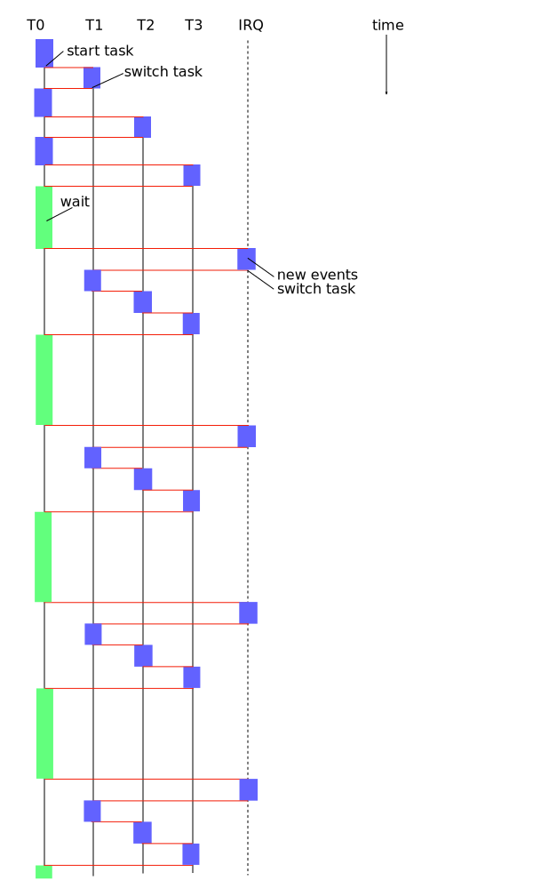

# Ćwiczenie nr 2

Ćwiczenie nr 1 pokazało jak bardzo marnowany był czas procesora w trakcie gdy
aktywny proces nie miał już nic to zrobienia i wchodził w blokującą funkcję WAIT.
Żaden proces nie powinien blokować procesora jeśli nie ma nic do roboty.
Proces powinien zwrócić sterowanie do jądra systemu informując jednocześnie na jakie
zdarzenie czeka. Jądro w tym czasie wykona inne zadania albo, jeśli nic nie będzie miało
do roboty, to przejście w stan niskiego poboru energii (o ile procesor ma taką instrukcję).

Zazwyczaj zdarzenia w systemie tworzy się dynamicznie w miarę potrzeby np. otwarcie pliku,
otwarcie gniazda sieciowego, uruchomienie zegara itp. Dla uproszczenia stworzymy 6 zdarzeń,
które będą istniały przez cały czas w systemie. Te zdarzenia to:

1. 4 zegary programowe o rozdzielczości 1/60 sekundy,
2. zmiana stanu klawiatury (wciśnięto lub puszczono klawisz),
3. VIC-II wygenerował przerwanie typu raster.

Oczywiście zegary nie będą "pracować" póki któryś z procesów nie uruchomi takiego
zegara wpisując wartość to przeładowania różną od 0. Podobnie przerwanie raster
od VIC-II będzie początkowo zablokowane.

Ponieważ nasz system jeszcze nie przechowuje żadnych dodatkowych informacji
o procesach (pomijam tu informacje niezbędne do przełączania zadań) więc na razie
nie będzie kontroli, który proces uruchomił dane zdarzenie (np. który zegar). To
programista będzie musiał zadbać aby proces nasłuchiwał tylko na te zdarzenia,
które sam uruchomił. Oczywiście w przyszłości trzeba będzie wprowadzić identyfikatory
procesów i przypisywać je do zasobów zajętych przez dany proces. 

Przy tak mocnych założeniach upraszczających, unixowa funkcja `select` (`poll`, `epoll`) czy
windowsowe `WaitForMultipleObjects` upraszcza się do podania bitowej maski zdarzeń na jakie
czeka dany proces. Będzie to oznaczało, że deskryptor zadania wydłuży się zaledwie
o 1 bajt, w którym będą zdefiniowane flagi sześciu zdarzeń. Jeśli jakieś zdarzenie
(lub kilka na raz) zaistnieje to proces dostanie bitowe znaczniki (np. w akumulatorze),
informujące co się stało. Ta wersja funkcji `SELECT` nie obsługuje przekroczenia czasu,
jednak zamknięcie zadania, który czeka na zdarzenia spowoduje przerwanie funkcji `SELECT`
z pustymi flagami zdarzeń (akumulator będzie miał wartość 0). Jedynym sposobem na
zrobienie przekroczenia czasu jest wykorzystanie dodatkowego zegara programowego, który
wygeneruje odpowiednie zdarzenie.

Robię jeszcze jedno założenie upraszczające, które polega na tym, że przełączanie
zadań ma prawo wykonać się w kontekście dowolnego zdania. To znaczy, że funkcja
`select` nie przełączy się na proces T0 a dopiero potem na inne zadanie, które 
także doczekało się na swoje zdarzenie. Takie podejście wydaje się rozsądne bo
minimalizuje przełączanie zadań.

Podobnie ja w ćwiczeniu nr 1, tu także konsola pozwala wydać tylko dwie komendy:

1. STOP <job> zamyka proces podanego typu, <job> może być literą S, M albo T (odpowiednio
   słońce, księżyc, wieżowce),
2. START <job> uruchamia proces podanego typu, <job> jak wyżej.

Błędna komenda zwróci ERROR, dobra komenda wykona się bez żadnego komunikatu.

W tej wersji programu `sunandmoon` nie ma już zjawiska zmiany prędkości animacji
w zależności od ilości aktualnie pracujących procesów.

W tym ćwiczeniu można już dodać czasowania czasu bezczynności. Proces bezczynności
jest przymusowo zadaniem 0 (nie można go zabić). W poprzednim ćwiczeniu to konsola
była zadaniem 0, a obecnie jest zadaniem 1. Procedury systemowe pozwalają zakończyć
zadanie 1 ale nie pozwala na to komenda `STOP`. Szacowanie czasu bezczynności jest 
zrobione orientacyjnie. Zmierzyłem, że jeśli pracuje tylko proces bezczynności (nawet
konsola nie pracuje) to licznik osiąga wartość średnią $18C94 w ciągu sekundy. Ta wartość została
przyjęta za 100%. Gdy pracuje tylko konsola to bezczynność jest na poziomie 99% a gdy 
pracują wszystkie procesy to bezczynność jest na poziomie 89%.

Przedstawiony tu model nie gwarantuje szybkiej reakcji na zdarzenie bo jeśli zdarzy
się wiele rzeczy jednocześnie (czyli między jednym przerwaniem a następnym) to 
procesy będą budzone w pierścieniu, a gdy już wszystkie zdarzenia zostaną obsłużone
to system będzie wykonywał (również w pierścieniu) zadania długotrwałe (czyli wszystkie
te zadania, które są aktywne ale nie czekają na zdarzenie w funkcji SELECT). Warto pomyśleć
o priorytetach zdarzeń. Na przykład przerwanie zegarowe jest mniej ważne od przerwania
rastrowego bo w przerwaniu rastrowym konieczna jest natychmiastowa zmiana położenia
sprita w procesie multiplikacji spritów. Jeśli reakcja nie będzie natychmiastowa
to multiplikacja się nie uda i niektóre postacie (lub ich fragmenty) nagle znikną
z ekranu na ułamek sekundy.

Poniższy diagram czasowy pokazuje jak działa program z ćwiczenia nr 2 (z znacznym
uproszczeniu).

